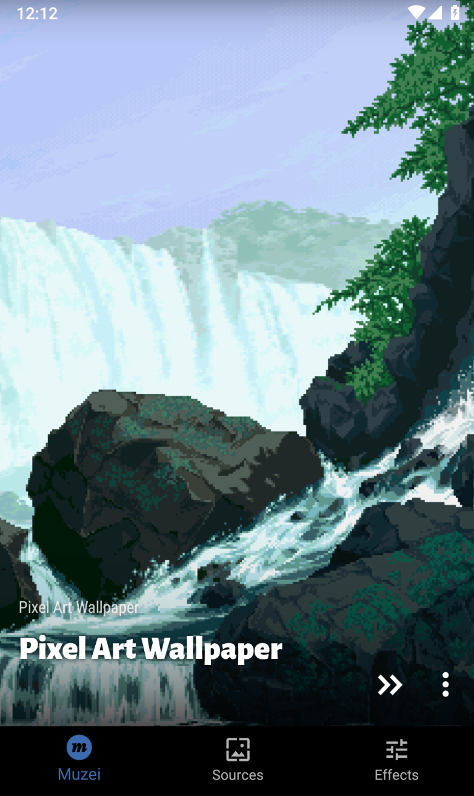
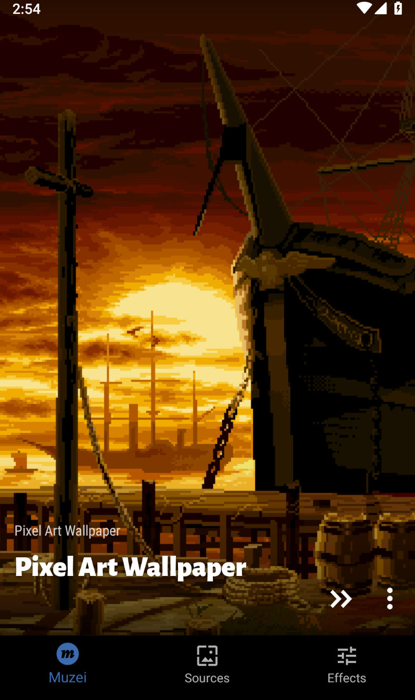
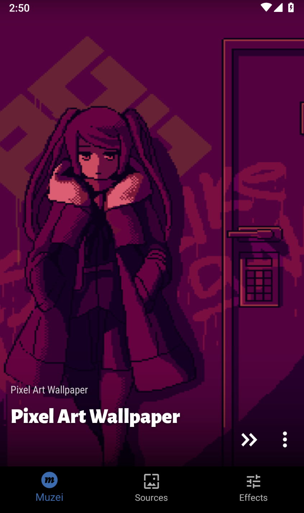
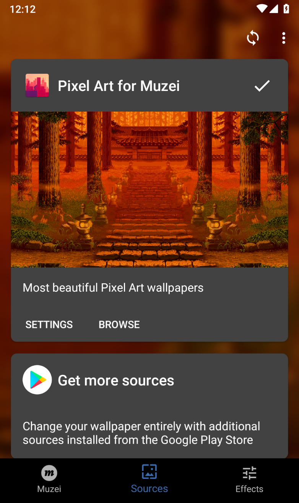
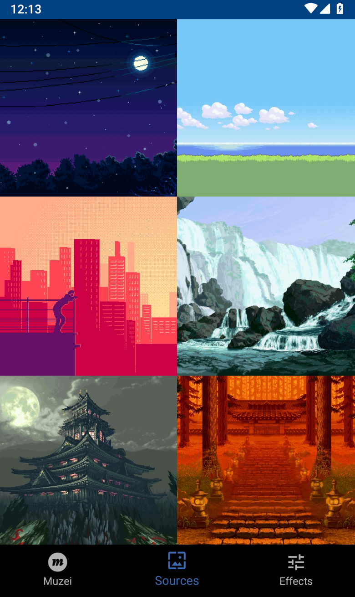

# Pixel Art for Muzei

[

](https://play.google.com/store/apps/details?id=com.michaldrabik.muzeipixelartextension)

## About

This is an extension for the live wallpaper app [Muzei](http://get.muzei.co/) by Roman Nurik.  
It requires Muzei to be installed.

This extension is powered by AWS services ([Link to repository](https://github.com/michaldrabik/muzei-pixelart-backend))

**If you wish to add your own wallpaper into the database please open an issue with 'new wallpapper' label.**  
**Thanks.**

## Screenshots

   
   
   
   
   

## License

**Copyright 2020 Michal Drabik**

This program is free software: you can redistribute it and/or modify it under the terms of the GNU General Public License as published by the Free Software Foundation, either version 3 of the License, or (at your option) any later version.  
This program is distributed in the hope that it will be useful, but WITHOUT ANY WARRANTY;
without even the implied warranty of MERCHANTABILITY or FITNESS FOR A PARTICULAR PURPOSE.
See the GNU General Public License for more details.  
You should have received a copy of the GNU General Public License along with this program.   
If not, see [http://www.gnu.org/licenses/](http://www.gnu.org/licenses/).
